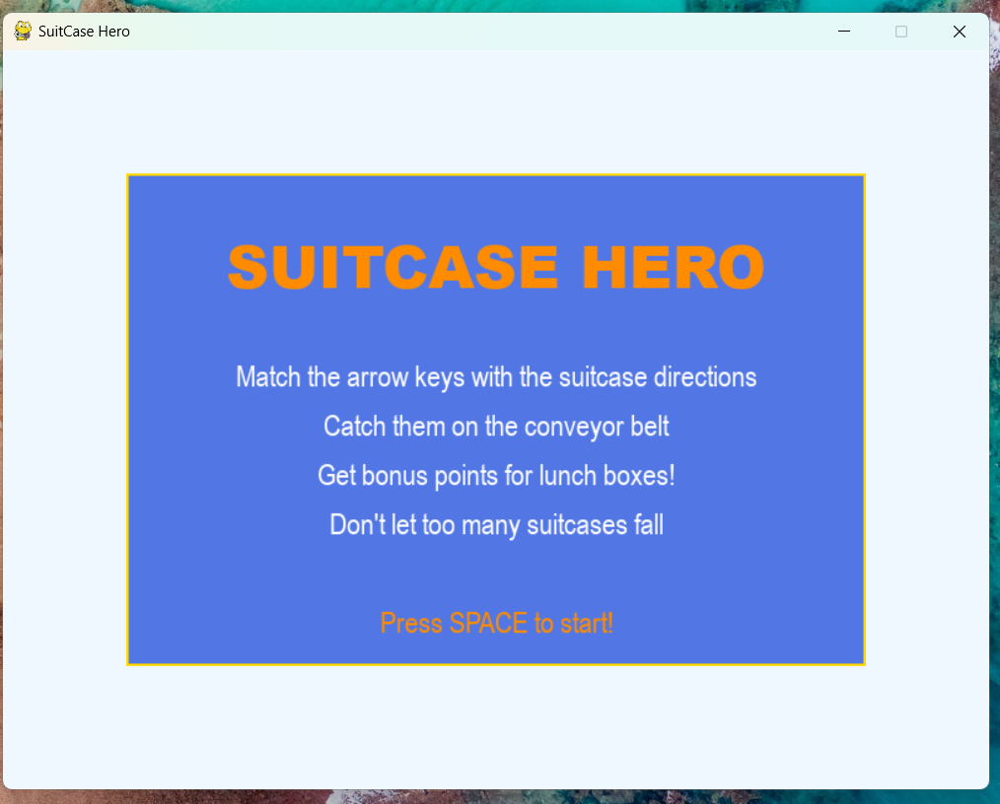
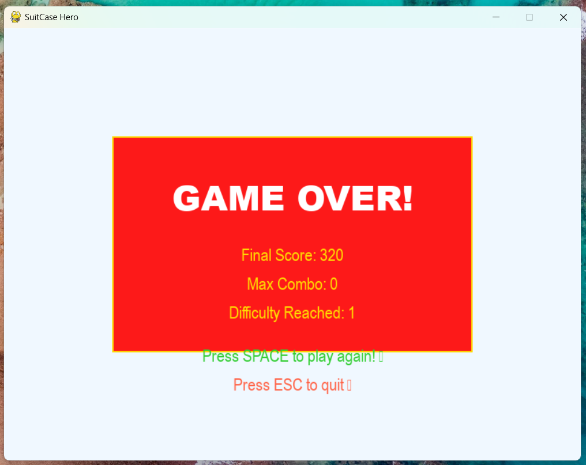

# 🎮 Suitcase Hero

A fast-paced arcade game where you help manage luggage at a busy airport! Match arrow keys with falling suitcases to score points and achieve high combos.

## 🌟 Features

- Dynamic difficulty scaling
- Combo system with special messages
- Bonus points for catching lunch boxes
- Different types of luggage with varying points and speeds
- Visual feedback for successful catches and mistakes

## 🎯 How to Play

1. Watch for falling suitcases with directional arrows
2. Press the matching arrow key when the suitcase reaches the conveyor belt
3. Build combos by catching suitcases consecutively
4. Don't let too many suitcases fall or press wrong keys
5. Look out for special lunch boxes for bonus points!

## 🎨 Controls

- ⬅️ Left Arrow: Catch left-pointing suitcases
- ➡️ Right Arrow: Catch right-pointing suitcases
- ⬆️ Up Arrow: Catch up-pointing suitcases
- ⬇️ Down Arrow: Catch down-pointing suitcases
- Space: Start game / Restart after game over
- ESC: Quit game

## 🛠️ Requirements

- Python 3.x
- Pygame library

## 📦 Installation

1. Clone the repository:
git clone https://github.com/yourusername/suitcase-hero.git
cd suitcase-hero

2. Install Pygame:
bash
pip install pygame

3. Run the game:
bash
python main.py

## 🏆 Scoring System

- Regular catches: Base points × combo multiplier
- Lunch box bonus: +50 points
- Wrong key press: -5 points
- Missed suitcase: Resets combo

## 💡 Tips

- Watch for the conveyor belt color change when suitcases are in the catch zone
- Build and maintain combos for higher scores
- Don't spam arrow keys when no suitcases are in range
- Higher levels spawn more challenging luggage types

## 🤖 AI Usage Note

AI (Claude) was used minimally during development for:
1. Bug fixing - specifically:
   - Fixed a combo reset issue where combo wasn't resetting properly when missing suitcases
   - Resolved a collision detection bug where suitcases were being caught outside the catch zone
2. Generating this README documentation

## ScreenShots

## 🎨 Credits

Created with:
- Pygame
- Icons: Built-in Emojis
- Font: Arial

## 🐛 Known Issues

- Game may lag on lower-end systems at higher difficulty levels
- Some visual glitches might occur with very high combo numbers

## 🔜 Planned Features

- Sound effects and background music
- High score leaderboard
- Additional luggage types
- Power-ups and special items

## 📄 License

MIT License - Feel free to use and modify!

## 🤝 Contributing

Contributions are welcome! Feel free to:
- Report bugs
- Suggest new features
- Submit pull requests
- Improve documentation